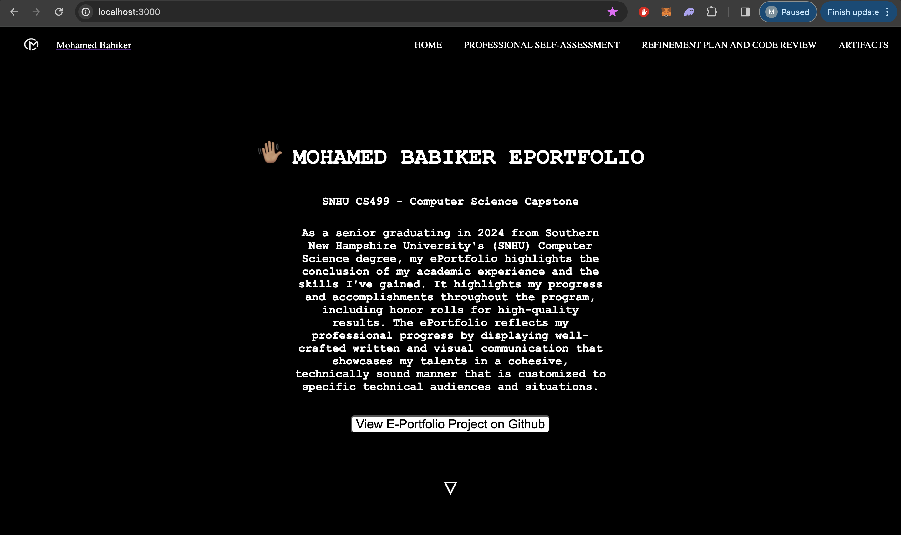

&nbsp;&nbsp;&nbsp;&nbsp;

## Welcome

Welcome to my ePortfolio! This digital collection showcases the knowledge and skills I have acquired throughout my Computer Science studies at Southern New Hampshire University (SNHU). This portfolio reflects my academic journey and professional growth, demonstrating my technical expertise and effective communication tailored for specific technical audiences.

### **Table of Contents**

- [Professional Self-Assessment](#self-assessment)
  - [Portfolio Considerations](#portfolio-considerations)
  - [Preparing For The Future](#preparing-for-the-future)
- [Refinement Plan and Code Review](#codereview)
  - [Code Review Videos Link](#code-reviews-video-link)
- [Software Design and Engineering](#softwaredesign)
  - [Artifact: Software Design and Engineering](#artifact-software-design-and-engineering)
- [Algorithms and Data Structure](#algorithms)
  - [Artifact: Algorithms and Data Structures](#artifact-algorithms-and-data-structures)
- [Databases](#databases)
  - [Artifact: Databases](#artifact-databases)
- [Reviews](#reviews)

## Professional Self-Assessment

Since starting my Computer Science program in January 2018, I've spent five years enhancing my programming and development skills, driven by a passion for technology and web development. My journey includes leading IT projects and implementing IT infrastructures.

In this program, I've honed crucial skills such as attention to detail, a security-focused mindset, and organization. Testing and developing code in manageable blocks have become integral to my workflow, ensuring that my projects are secure and free of vulnerabilities. Embracing a tester's mindset has enhanced my ability to produce reliable software.

    
    
<em>Figure 1 - OpenGL ZigZag Chair - CS330 Computational Graphics and Visualization</em>

Attention to detail is vital in code reviews, security standards, and best practices. Adopting a security-first approach helps me develop secure, maintainable software. Seeking peer feedback improves my work and fosters collaboration and communication skills.

Through the Software Development Lifecycle, I've learned the importance of project management and team coordination. Understanding client needs translates into effective algorithms and pseudocode, making the development process rewarding. My soft skills, including creativity, communication, and time management, have also flourished.

| **Hard Skills** | **Soft Skills** |
|:-----------:|:-----------:|
| Computer and Technology Skills | Organizational |
| Data Analysis | Attention to Detail |
| Data Visualization | Critical Thinking |
| Programming | Problem Solving |
| Software Development | Collaboration |
| Web Development | HTML/CSS/JS/Markdown |
| Technical Writing| JAVA |
| Security Mindset | Python |
| Mobile Development | C++ |

I've grown in my ability to quickly learn new skills, solve problems with humility, and lead with confidence. These skills and my passion for technology make me a strong candidate for a software engineering role, focused on creating understandable and maintainable algorithms.

    <a href="#">
        <button style="font-size: 12px; font-weight: bold; background: #ff9800; color: #ffffff; border-radius: 10px; border-style: solid; border-color: #ff9800; padding: 8px 12px;">Back to Top &#8593;</button>
    </a>

### _Portfolio Considerations_

<blockquote style="font-size: 18px; color: #ff5722;">
  <em>“Any fool can write code that a computer can understand. Good programmers write code that humans can understand.”</em>
  
- Martin Fowler

</blockquote>

Each course in the Computer Science program has significantly contributed to my skill set. Here, I showcase artifacts demonstrating the knowledge and abilities gained from these impactful courses.

Courses like CS250 (Software Development Lifecycle) taught me the importance of teamwork and client communication. IT145 (Foundation in Application Development) and CS260 (Data Structures and Algorithms) deepened my understanding of algorithms and data structures. CS310 (Collaboration and Team Project) emphasized the necessity of teamwork for large projects.

    
    
<em>Figure 2 - Thermostat Lab Guide - CS350 Emerging Systems Architecture and Technologies</em>

Courses like CS360 (Mobile Architecture and Programming) and CS330 (Computational Graphics and Visualization) opened my mind to software design and engineering complexities. Through these, I demonstrated my ability to implement computing solutions that meet industry-specific goals. CS340 (Client/Server Development) and DAT220 (Fundamentals of Data Mining) highlighted the value of databases in collaborative environments.

The artifacts selected for code review in software design, algorithms, and databases reflect my learning and competency in the program.

    <a href="#">
        <button style="font-size: 12px; font-weight: bold; background: #ff9800; color: #ffffff; border-radius: 10px; border-style: solid; border-color: #ff9800; padding: 8px 12px;">Back to Top &#8593;</button>
    </a>

### _Preparing For The Future_

The Computer Science program has prepared me for a fulfilling career, enabling me to contribute significantly to the field. This ePortfolio demonstrates my ability to use innovative techniques and implement valuable computing solutions. I look forward to learning and growing in future roles, collaborating with peers, and contributing to exciting projects.

I am motivated to complete challenging work, seek guidance from experienced mentors, and foster a collaborative culture. As a highly dependable professional, I am eager to excel in new technologies and quickly gain the required skills.

    <a href="#">
        <button style="font-size: 12px; font-weight: bold; background: #ff9800; color: #ffffff; border-radius: 10px; border-style: solid; border-color: #ff9800; padding: 8px 12px;">Back to Top &#8593;</button>
    </a>

## Refinement Plan and Code Review

Code reviews are a crucial part of software development, ensuring quality and catching critical bugs early. They enhance team skills and maintain code quality. Through systematic code reviews, I aim to improve the overall quality of the software and my skills.

    
    
<em>Figure 3 - Zoo Monitoring System Program Java Code Screenshot</em>

Code reviews foster fault tolerance and better code maintenance. Reviewing selected artifacts for software design, algorithms, and databases has helped me develop strategies for collaborative environments, supporting organizational decision-making in computer science.

### _Code Review Videos Link_

	

    <a href="#">
        <button style="font-size: 12px; font-weight: bold; background: #ff9800; color: #ffffff; border-radius: 10px; border-style: solid; border-color: #ff9800; padding: 8px 12px;">Back to Top &#8593;</button>
    </a>

## Software Design and Engineering

### _Artifact: Software Design and Engineering_

The selected artifact for this category is the **Inventory App**, developed as part of the CS360 Mobile Architecture and Programming course. The app tracks...
